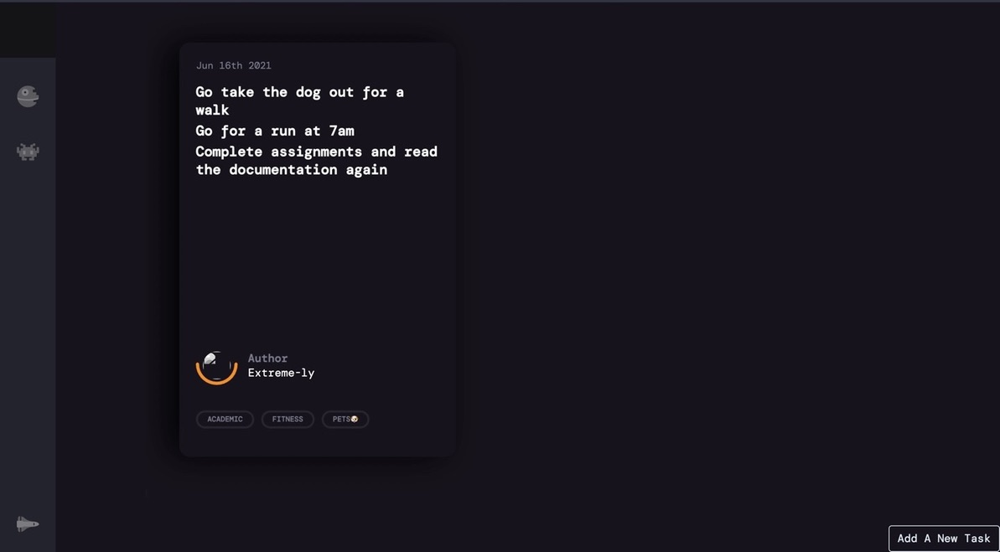

# ParMeddon

1. Why I Made The Project

in my experience task mangers have always been boring and a very plain experience, you cant just quickly access your tasks and the design may be good but feels plain while using, the answer to all that, is putting the tasks in a card. (Hopefully.)

2. Frameworks and Libraries used to make the project 

I used Flask for the backend, and SQLalchemy for the database. JavaScript to detect when a task has been deleted and which task. Plain CSS and HTML for the webpages.

3. How to use

The UI is pretty straightforward. You can make a new task by clicking the button in the lower-right corner of the screen, choose a date and write tags related to what the task is about, for seprating tasks and getting them to appear on new lines, for example:
Task1
Task2
Task3

You can use the "|" hence to do what was done above we can type in the main textbox Task1|Task2|Task3

<h1> WARNING: Branch 'master' is the actual working version. </h1>

